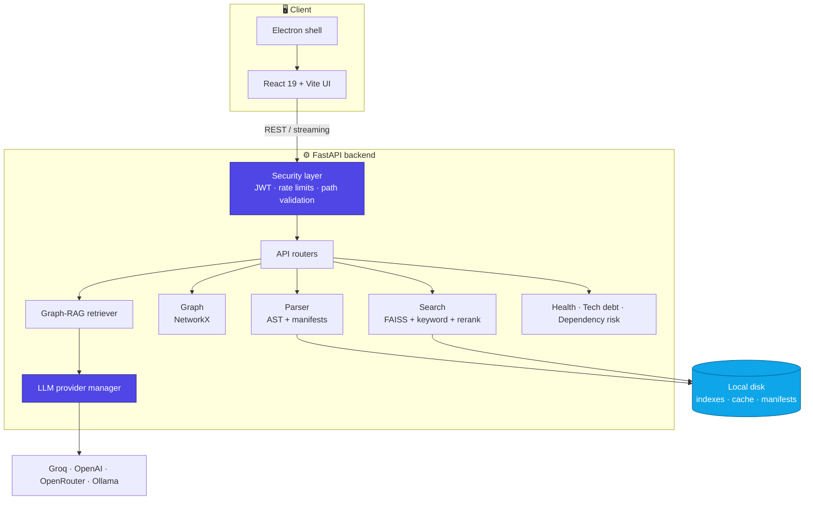
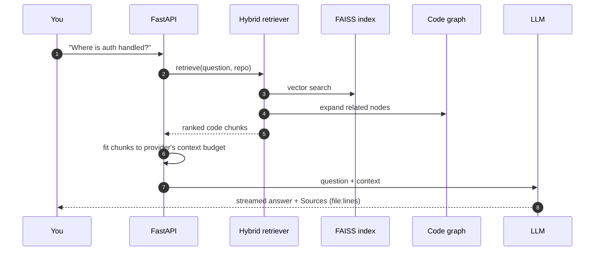

<div align="center">


<a href="https://github.com/Arnav-aka-guy/Repository-scanner-engine">
  
</a>

<br/>

<a href="https://github.com/Arnav-aka-guy/Repository-scanner-engine/actions/workflows/ci.yml"></a>


<br/><br/>


<br/><br/>

**[Features](#-features)** &nbsp;•&nbsp;
**[Language support](#-language-support-matrix)** &nbsp;•&nbsp;
**[Quick start](#-quick-start)** &nbsp;•&nbsp;
**[Architecture](#%EF%B8%8F-architecture)** &nbsp;•&nbsp;
**[Configuration](#%EF%B8%8F-configuration)** &nbsp;•&nbsp;
**[API](#-api-at-a-glance)** &nbsp;•&nbsp;
**[Security](#-security)**

</div>


## 💡 What is this?

Opening a new codebase usually means hours of clicking through folders and guessing how things connect. **Repository Scanner Engine** does that groundwork for you.

You point it at a local folder or a public GitHub URL. It parses the code, builds a graph of how files, classes and functions relate, indexes everything for hybrid search, and lets you ask questions in plain English. Answers come back with verified sources and line ranges drawn from the actual codebase.

It runs as a web app, as a desktop app (Electron), or in Docker, and works with cloud LLMs (Groq, OpenAI, OpenRouter) or fully offline with Ollama.

## ✨ Features

<table>
<tr>
<td width="50%" valign="top">

### 📁 Repository explorer
Deep structural parsing for **Python, TypeScript and JavaScript** extracting files, imports, classes, functions, and docstrings. Pluggable `LanguageParser` protocol allows clean additions.

</td>
<td width="50%" valign="top">

### 🕸️ Dependency graph
An interactive view of how modules connect: imports, inheritance, containment, and call relationships, with filters to cut through the noise. Built on NetworkX.

</td>
</tr>
<tr>
<td width="50%" valign="top">

### 🔍 Hybrid code search
Combines dense semantic vector retrieval (**FAISS**) with sparse lexical matching (**BM25 inverted index**), fused via **Reciprocal Rank Fusion (RRF)** for optimal recall.

</td>
<td width="50%" valign="top">

### 💬 Grounded AI assistant
Ask questions about the code. Answers combine vector retrieval and call-graph traversal with verified file references and line citations.

</td>
</tr>
<tr>
<td width="50%" valign="top">

### 🩺 Health & tech debt
Transparent, traceable health scoring (0–100) across documentation, complexity, architecture, maintainability, and security, with exact penalty formulas and file attribution.

</td>
<td width="50%" valign="top">

### ⚡ Incremental rescans
File manifests with SHA-256 hashes mean only changed files are re-parsed and re-embedded, caching unmodified representations for instant re-scans.

</td>
</tr>
<tr>
<td width="50%" valign="top">

### 🌐 GitHub scanning
Paste a public GitHub URL and it performs a validated, sandboxed `--depth 1` clone into a temporary workspace for instant analysis.

</td>
<td width="50%" valign="top">

### 📝 Docs & comparisons
Generate structured markdown documentation, export Mermaid architecture diagrams, and compare two repositories side-by-side.

</td>
</tr>
</table>

### 🌐 Language Support Matrix

| Support Tier | Languages / Extensions | Capabilities |
|---|---|---|
| **Full Structural AST Analysis** | Python (`.py`), TypeScript (`.ts`, `.tsx`), JavaScript (`.js`, `.jsx`, `.mjs`, `.cjs`) | Full AST parsing: function signatures, docstrings, classes, interfaces, import graphs, internal call graphs, calibrated dead-code detection, indentation nesting depth |
| **Hybrid Search & Token Matching** | Python, TypeScript, JavaScript, JSON, Markdown, YAML | Dense vector embeddings (FAISS) + BM25 sparse keyword search + Reciprocal Rank Fusion (RRF) reranker |
| **File-Level Discovery & Scanning** | 30+ extensions (`.go`, `.rs`, `.java`, `.cpp`, `.c`, `.cs`, `.rb`, `.php`, `.sql`, `.sh`, etc.) | File tree discovery, line count metrics, SHA-256 change manifests, code viewer, and semantic embedding |
</tr>
</table>

## 🚀 Quick start

> **Prerequisites:** Python 3.12+ and Node.js 18+

```bash
# 1. Clone
git clone https://github.com/Arnav-aka-guy/Repository-scanner-engine.git
cd Repository-scanner-engine

# 2. Backend
python -m venv venv
source venv/bin/activate          # Windows: .\venv\Scripts\activate
pip install -r backend/requirements.txt

# 3. Config — add at least one LLM key (or use Ollama)
cp .env.example .env

# 4. Frontend + run everything
npm install
cd frontend && npm install && cd ..
npm run dev
```

Then open:

| What | Where |
|---|---|
| 🖥️ Web app | http://localhost:5173 |
| ⚙️ Backend API | http://127.0.0.1:8000 |
| 📖 Interactive API docs | http://127.0.0.1:8000/api/docs |

<details>
<summary><b>🖥️ Run as a desktop app (Electron)</b></summary>

<br/>

```bash
cd desktop && npm install && cd ..
npm run dev:desktop
```

The desktop shell starts the backend on `127.0.0.1` for you.

</details>

<details>
<summary><b>📦 Production mode (FastAPI serves the built frontend)</b></summary>

<br/>

```bash
cd frontend && npm run build && cd ..
python -m uvicorn backend.main:app --host 127.0.0.1 --port 8000
```

Everything is then available at http://127.0.0.1:8000, including client-side routes.

</details>

<details>
<summary><b>🐳 Docker</b></summary>

<br/>

```bash
docker compose up --build
```

Put the repositories you want to scan in `./repos`. Inside the container they appear under `/repos/...`. The compose file publishes the port on `127.0.0.1` only.

</details>

## 🏗️ Architecture



<details>
<summary><b>🔁 How a chat question is answered</b></summary>

<br/>



</details>

## 🧰 Tech stack

| Layer | Tools |
|---|---|
| **Frontend** | React 19, TypeScript, Vite, Tailwind CSS v4, Zustand, Framer Motion |
| **Backend** | Python 3.12+, FastAPI, Uvicorn, Pydantic v2 |
| **Analysis** | Python `ast`, TypeScript/JavaScript parser, NetworkX |
| **Search** | Sentence Transformers (`all-MiniLM-L6-v2`), FAISS |
| **AI providers** | Groq, OpenAI, OpenRouter, Ollama (offline) |
| **Security** | JWT (python-jose), bcrypt, slowapi |
| **Storage** | Local filesystem by default; optional PostgreSQL (SQLAlchemy 2.0 async + Alembic) |
| **Desktop / infra** | Electron, Docker multi-stage build, GitHub Actions |

## ⚙️ Configuration

All settings live in `.env`. The full list with comments is in [`.env.example`](.env.example).

<details>
<summary><b>🤖 LLM providers</b></summary>

<br/>

```env
# "auto" picks the first provider that has a key, or Ollama
LLM_PROVIDER=auto

GROQ_API_KEY=
OPENAI_API_KEY=
OPENROUTER_API_KEY=

# Ollama (local, offline)
LLM_BASE_URL=http://localhost:11434
LLM_MODEL=llama3

# Optional: cap retrieved context (default 12,000 chars for Groq, 32,000 for others)
# LLM_CONTEXT_CHAR_BUDGET=12000
```

If a model hits a rate limit or is unavailable, the provider manager falls back to another model automatically.

</details>

<details>
<summary><b>📂 Allowed folders (recommended)</b></summary>

<br/>

Limit scanning and file reading to folders you trust:

```env
ALLOWED_ROOTS=/home/you/projects,/home/you/work
```

Anything outside these folders is refused with `403`. Setting this is strongly recommended.

</details>

<details>
<summary><b>🔐 Authentication (optional, off by default)</b></summary>

<br/>

```bash
# 1. Generate a JWT secret
python -c "import secrets; print(secrets.token_hex(32))"

# 2. Generate a password hash
python scripts/hash_password.py
```

```env
AUTH_ENABLED=true
JWT_SECRET_KEY=<the secret from step 1>
ADMIN_USERNAME=admin
ADMIN_PASSWORD_HASH=<the hash from step 2>
```

With auth on, the web app shows a login screen and sends a Bearer token with every request. The server refuses to start if the secret is weak or a known placeholder.

</details>

<details>
<summary><b>📏 Scan limits</b></summary>

<br/>

```env
MAX_FILES=10000
MAX_FILE_SIZE_BYTES=5242880   # 5 MB
MAX_DIRECTORY_DEPTH=30
```

</details>

## 🔌 API at a glance

Full interactive docs are at **`/api/docs`** once the server is running.

| Area | Endpoints |
|---|---|
| **Auth** | `POST /api/auth/token` · `GET /api/auth/status` |
| **Repository** | `POST /api/repository/scan` · `POST /api/repository/scan/async` · `GET /api/repository/scan/jobs/{id}` · `POST /api/repository/scan-github` · `GET /api/repository/files` · `GET /api/repository/file/{path}` |
| **Graph** | `GET /api/graph/dependency` · `GET /api/graph/call` · `GET /api/graph/analysis` |
| **Search & chat** | `POST /api/search` · `POST /api/chat` (streaming) · `GET /api/chat/history` |
| **Insights** | `GET /api/health-score` · `GET /api/tech-debt` · `GET /api/dependency-risk` · `POST /api/compare` |
| **Architecture & docs** | `POST /api/architecture/report` · `GET /api/architecture/layers` · `POST /api/docs/generate` · `GET /api/docs/export` |
| **Visualization** | `GET /api/viz/mermaid` · `GET /api/viz/architecture` |
| **Settings** | `GET /api/settings/providers` · `GET /api/settings/ai-health` |

## 🔒 Security

This tool reads source code from your disk, so it is built to be careful about it:

- **Local by default.** The server binds to `127.0.0.1`. Only expose it on a network with `AUTH_ENABLED=true` and `ALLOWED_ROOTS` set.
- **Path containment.** Paths are resolved first and then checked against the repository root. `../` traversal, symlink escapes, system folders and sensitive folders such as `.ssh` and `.aws` are refused.
- **Optional JWT auth** with bcrypt password hashing and startup checks for weak secrets.
- **Rate limits** on scan, search, chat, file and login endpoints.
- **Scan limits** on file count, file size and folder depth.
- **Clean errors.** Error messages sent to the client are trimmed, and API keys are redacted.

Found a security issue? Please open a private security advisory on GitHub instead of a public issue.

## 🧪 Testing

```bash
# Backend tests — mock mode skips the embedding model download
MOCK_EMBEDDINGS=true pytest

# Frontend tests (Vitest)
npm run test:frontend

# Lint, format and type checks
ruff check backend
ruff format --check backend
mypy backend --ignore-missing-imports
```

CI runs lint, backend tests with coverage, type checks and a frontend test + build on every push and pull request.

## 📁 Project structure

```text
Repository-scanner-engine/
├── backend/
│   ├── api/            # FastAPI routers
│   ├── parser/         # AST parsers, scanner, manifests
│   ├── graph/          # Graph building and architecture analysis
│   ├── embeddings/     # Encoder, FAISS store, keyword search, reranker
│   ├── retrieval/      # Vector, graph and hybrid retrievers
│   ├── llm/            # Groq, OpenAI-compatible, OpenRouter, Ollama providers
│   ├── services/       # Health score, tech debt, dependency risk, GitHub scanner
│   ├── security/       # Auth, path validation, sanitizing, rate limits
│   └── main.py         # App entry point
├── frontend/           # React 19 + Vite app
├── desktop/            # Electron shell
├── tests/              # Backend test suite
├── alembic/            # Optional database migrations
├── scripts/            # Helper scripts (password hashing)
├── Dockerfile
└── docker-compose.yml
```

## 🗺️ Roadmap

- [ ] More languages (Go, Java, Rust) through the `LanguageParser` protocol
- [ ] Persist scan jobs so they survive restarts
- [ ] Private GitHub repositories with a personal access token
- [ ] Export health reports as PDF

## 🤝 Contributing

Contributions are welcome.

1. Fork the repo and create a branch: `git checkout -b feat/your-idea`
2. Make your change and add tests
3. Make sure `pytest`, `ruff check backend` and `npm run test:frontend` pass
4. Open a pull request with a clear description

## 📜 License

Released under the [MIT License](LICENSE).

<div align="center">

<br/>

**If this project helped you, consider giving it a ⭐**

Made by [Arnav Chaudhary](https://github.com/Arnav-aka-guy)


</div>
